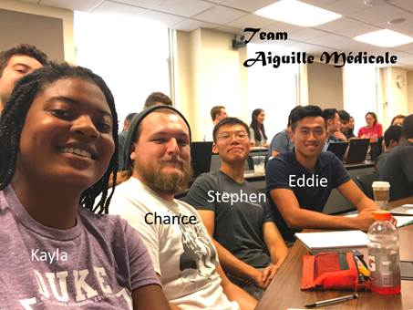
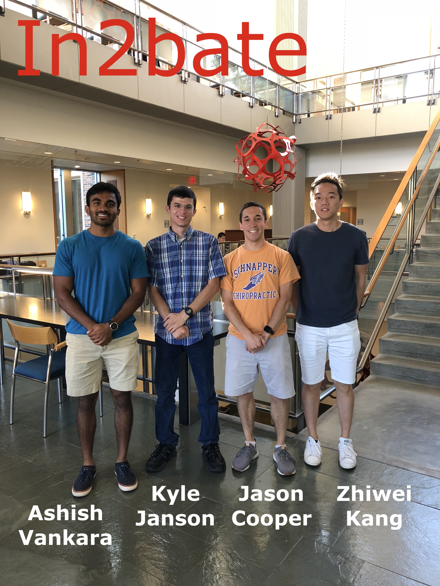
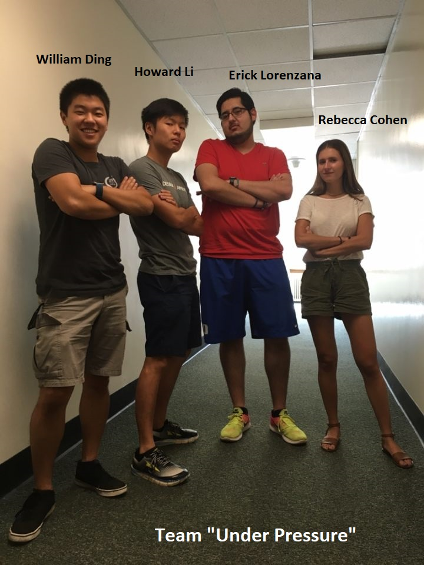
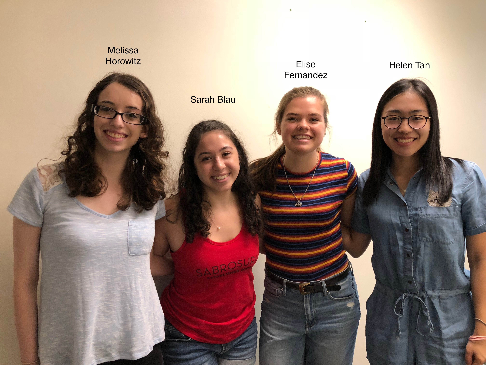
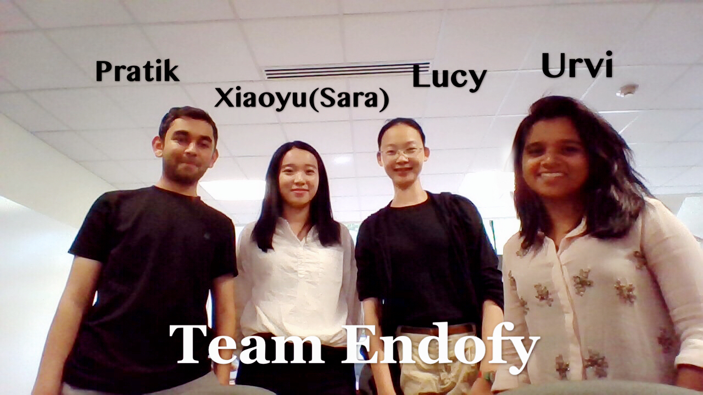
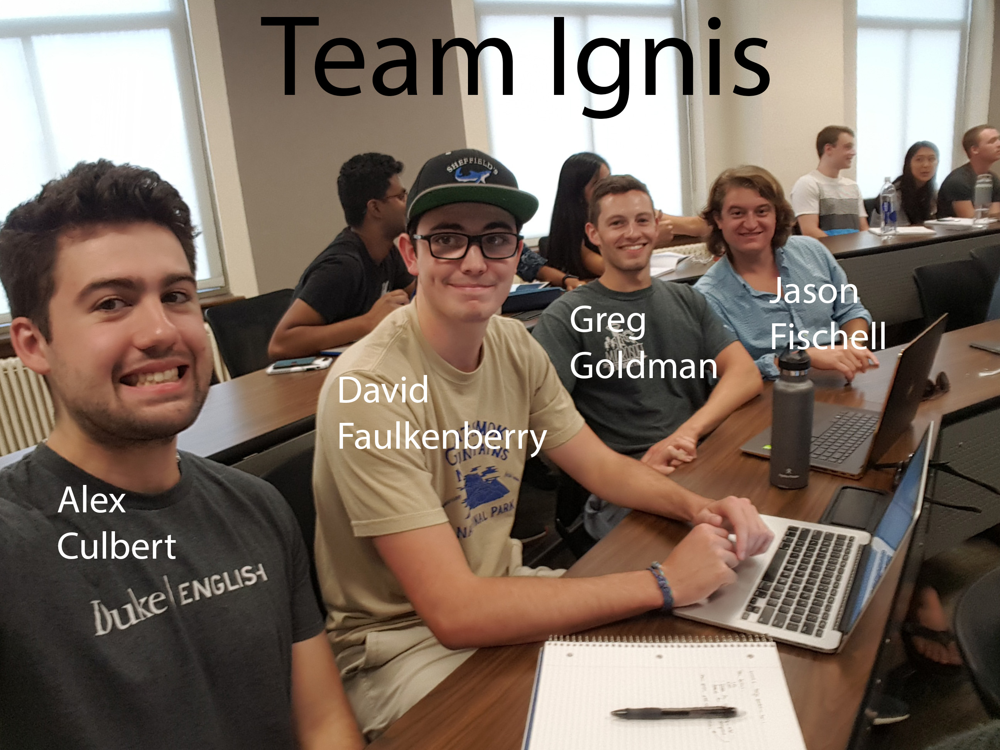
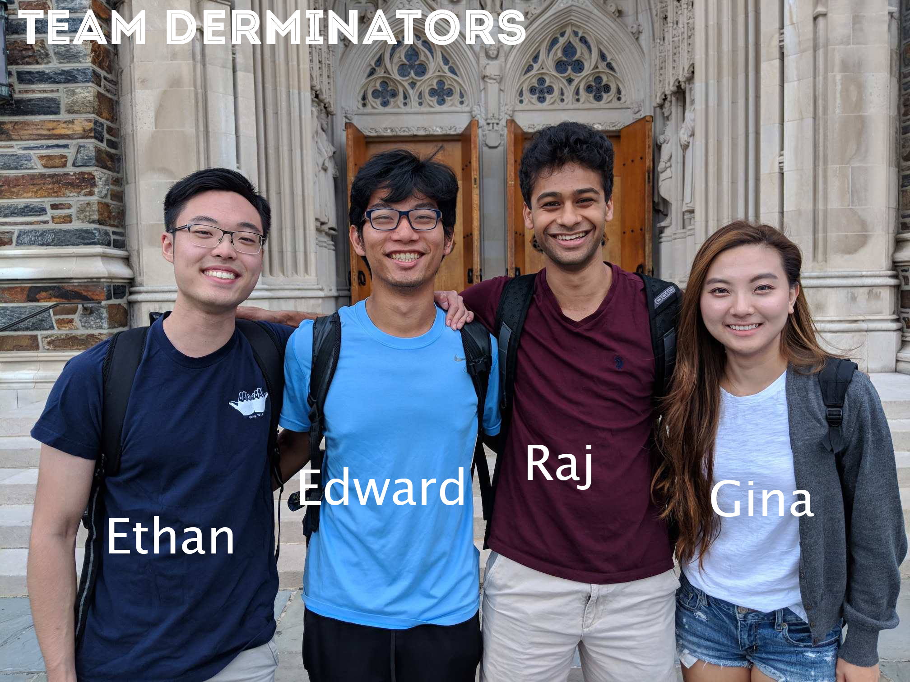

# Medical Device Projects (Fall 2018 / Spring 2019)

## Aiguille Medicale
### Clinical Sponsor
Dr. Ali Amin Sharifi, M.D. (Surgery / Urologic Oncology)

### Problem Statement
Laparoscopic needle detector system for localization of retrieving a lost
needle in the abdomen.

### Team

## UroSolutions
### Clinical Sponsor
Dr. Ali Amin Sharifi, M.D. (Surgery / Urologic Oncology)

### Project Statement
Measurement system to measure the length of the ureter (bladder) / prostate.

### Team

## In2bate 
### Clinical Sponsor
Dr. Ian Welsby, M.D. (Department of Anesthesiology)

### Problem Statement
Low-cost, combined suction/visualization intubation device for OR, ED,
military, & EMT applications.

### Team

## UnderPressure
### Clinical Sponsor
Dr. Muath Bishawi, M.D. (Cardiothoracic Surgery)

### Problem Statement
Improved, non-invasive blood pressure monitor for use at home.

### Team

## Rock-a-vibe 
### Clinical Sponsor
Dr. David Tanaka, M.D. (Department of Neonatology)

### Problem Statement
Pediatric transport vibration and noise monitor.

### Team

## Endofy
### Clinical Sponsor
Dr. David Leiman, M.D. (Department of Gastroenterology)

### Problem Statement
Diagnostic and therapeutic flexible gastrointestinal endoscopy is made possible
by through-the-scope working tools. These tools exit the working channel in a
single orientation (traditionally parallel to the lumen and/or straight ahead),
which potentially limits their utility. Articulating devices such as biopsy
forceps or polypectomy snares would substantially increase the degree of
freedom with which challenging interventions are performed. 

### Team

## Ignis
### Clinical Sponsor
Dr. Ana Ceclia Rodriguez, M.D.

### Problem Statement
Small-volume medical waste incineration.

### Team

## Carpal Diem
### Clinical Sponsor
Dr. Marc Richard, M.D. (Department of Surgery)

### Problem Statement
The measurement of the small joints of the fingers/hand/wrist is tedious and is
currently done by a manual process using a handheld goniometer.  There is
significant opportunity to make this process faster, more accurate, and more
reproducible.  This project seeks to create a device that through image capture
technology can ease the process and in turn, improve patient care.  The
exportable data will be easily uploaded into electronic medical records or
research files offering significant benefit to clinicians as well.

### Team

## Derminators
### Clinical Sponsor
Dr. Carlos Eduardo, M.D. (Department of Dermatology)

### Problem Statement
Mobile body scanning platfrom to track skin lesion evolution.

### Team

