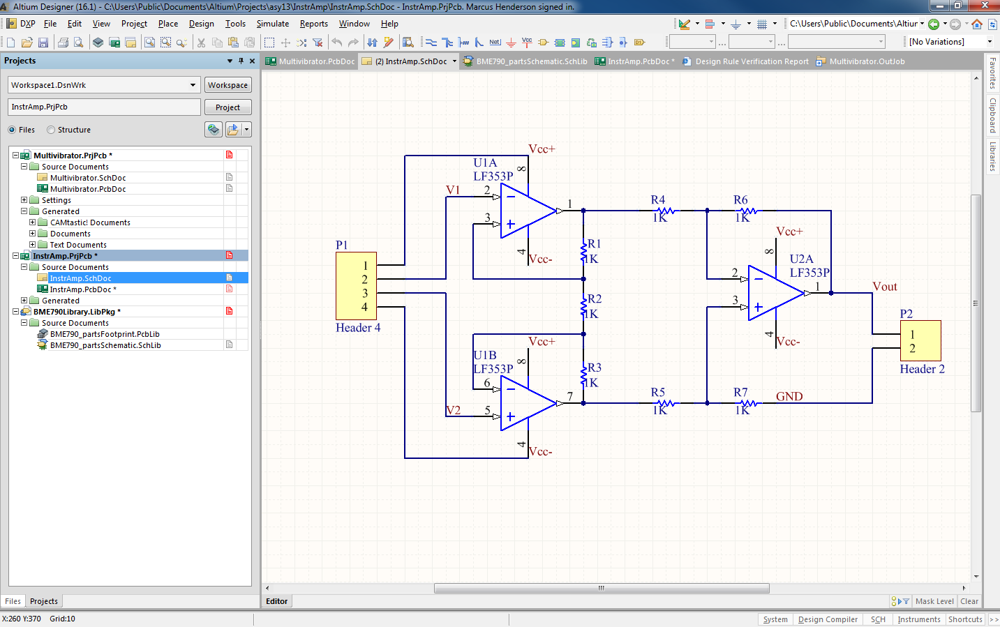
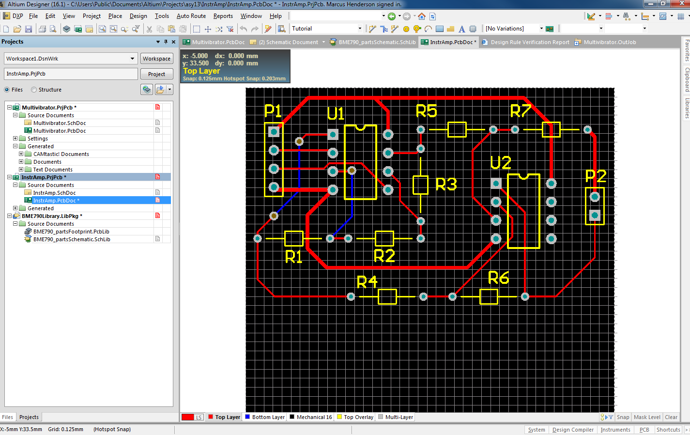

# BME790 - Learning PCB design with Altium Designer.

Printed circuit board (PCB) design is the next step to translate your bread-board electronics prototype into a more robust and stable form. For a refresher on bread-board, see [this tutorial](https://learn.sparkfun.com/tutorials/how-to-use-a-breadboard). PCB design is almost completely done through computer-aided drafting (CAD) programs. A variety of PCB CAD softwares exist, we will be using **Altium Designer 16**.

## Basics

PCB design can be divided roughly into two steps: **schematic** and **board** design. 

In **schematic design**, you visualize the electronic components with *symbols* (e.g. resistor, capacitor, opamp symbol), *nets* (e.g. Vcc, gnd), and *labels* (e.g. R1, C1). This is most simliar to our drawing circuit diagrams in class. 

To familiarize yourself with schematic reading, read [this tutorial](https://learn.sparkfun.com/tutorials/how-to-read-a-schematic). 

Note that the symbols shown in this tutorial will look slightly different from what you will see in Altium Designer -- those are only minor stylistic differences. The key take away is given any electronic symbol, you should be able to identify its **terminals**, which allows that component to be connected in a circuit.

In **board design**, you translate the schematic into *footprints* connected by *traces* on a physical board design. The *footprint* of a component is a physical space that component will occupy on the final circuit board, along with its terminal connections. *Traces* are wires printed on the circuit board connecting the components.

Read [this tutorial](https://learn.sparkfun.com/tutorials/pcb-basics/all) for a basic overview of PCB concepts. You don't have to memorize all the terms, just be familiar with them so you can refer back to it.

## Altium Tutorial

Armed with these concepts, you are ready to start learning Altium. Head to [Altium Tutorial](https://techdocs.altium.com/display/ADOH/Tutorial+-+Getting+Started+with+PCB+Design). 

This tutorial will introduce you to the basic features of the software while going through the design of a multi-vibrator circuit. You do not have to understand functional what the circuit does.

The tutorial is long. Try to finish at least the [Compiling the project to check for errors](https://techdocs.altium.com/display/ADOH/Tutorial+-+Getting+Started+with+PCB+Design#Tutorial-GettingStartedwithPCBDesign-CompilingtheProjecttoCheckforErrors) section in the first lab session.

## BME790 components library

From the tutorial you should have learned about how Altium manages the schematic symbols and its associated PCB footprint with the library system.

We have made an Altium intergrated library for the parts available in the class lab. When you design your project, try to limit your parts from within this library. For a list of these components, see [the parts spreadsheet](BME790_PartsList.xlsx).

This parts list is broken into three sections:

1. Integrated circuit (IC) packages. The first column contains the name of the parts in the library, as well as the labels on the physical chip. For more information on what these components do, refer to their [datasheets](datasheets/). Given any part, you can also search for their datasheet online by entering the markings found on the chip.

2. Capacitors. The first column is the different capacitor values available. There are two types of capacitor available - *Cermaic monolithic* and *Radial Electrolytic*. Electrolytic capacitors are polarized.

    In schematic capture, the first type uses the *Cap* symbol and the second type uses the *Cap pol* symbol.

    For capacitors of 47uF to 2200uF, the size vary significantly, therefore I did not provide a footprint for them in this library. If you need to use one of these, you can make your own footprint as needed.
3. Resistors. The first column is the available resistor values. All resistors use the same schematic symbol *Resistor* and the same footprint *Res*.
4. Diodes. The first column is the avaiable diodes/rectifiers, which also serve as the schematic symbol names. All diodes use the same footprint *Diode*. Note that diodes are directional.

The integrated library file can be found [here](BME790Library.IntLib). To use it, save it and install it within Altium Designer, as per Altium Designer Tutorial.

This library combined with Altium's built-in *Miscellaneous Devices* and *Miscellaneous Connectors* libraries should be sufficient for all non-microcontroller parts.

For more information on Altium library management, see Altium documentation on:

1. [Components, Model and Library Concepts](http://techdocs.altium.com/display/ADOH/Component,+Model+and+Library+Concepts)
2. [Creating Library Components Tutorial](http://techdocs.altium.com/display/ADOH/Creating+Library+Components+Tutorial)
3. [Enhanced Library Management Using Integrated Libraries](http://techdocs.altium.com/display/ADOH/Enhanced+Library+Management+Using+Integrated+Libraries)
4. [Building an Integrated Library](http://techdocs.altium.com/display/ADOH/Building+an+Integrated+Library)

## Exercise - Instrumentation Amplifier

After you have finished the tutorial, practice what you have learned by designing your in Altium an instrumentation amplifier. As this is simply a CAD exericse, you can use any of the opamps available in the BME790 parts library (for your actual project, you should read through the opamp's datasheet to decided which ones are the most suitable). An example is shown below:

In this circuit I used three **LF353P** opamps in this circuit: *U1A*, *U1B*, and *U2A*. Since each **LF353P** IC package contains two opamps, this means I am using two of these chips (*U1A* and *U1B* belong to the same package). In addition, I used **Header4** and **Header2** components from the connectors library, they serve as the signal input/output (*V1*, *V2*, *Vout*) and power input/output (*Vcc+*, *Vcc-*, *GND*) to this circuit.

The corresponding PCB layout is shown below, note that yours **does not** have to look the same as mine.

Make sure to run DRC on your schematic and PCB, refer back to the tutorial if needed. 

When you run rule-check on the schematic, set the violation *Nets with no driving source* to *warning* (**Project**>>**Project Options**>>**Error Reporting**).

When you run DRC on the PCB, you can ignore the rule violations 

1. *Fabrication Testpoint Usage*
2. *Assembly Testpoint Usage*

When you have passed the DRC of the entire project, create the Bill of Materials (BOM) for you newly designed instrumentation amplifier. Verify the parts on that list is reasonable.

## Finding help for Altium Designer

While we are here to help, Google is always your friend when you run into problems and questions on Altium. Designer has a lot of features and Altium has a lot of tutorials and documentations on different aspects of this software, don't hesitate to refer to them.
