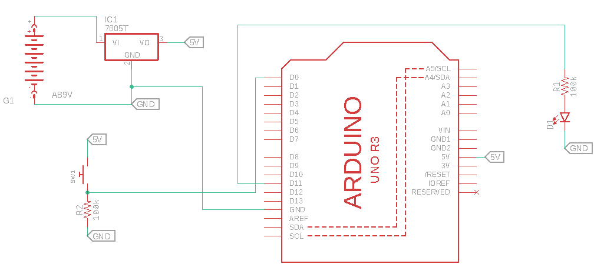
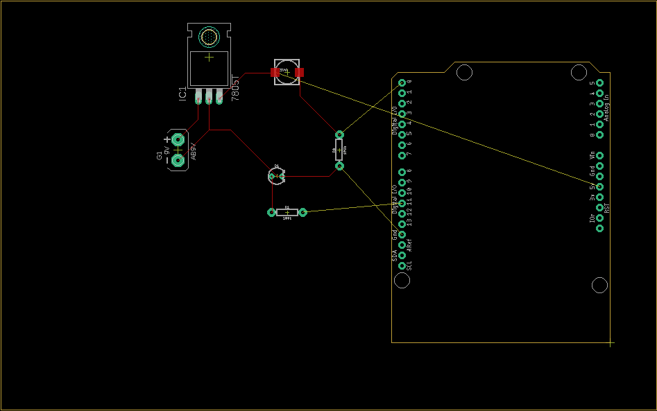

# Example MCU-based Schematic

The following is an example of an MCU-based electronics solution to the
prototyping skills challenge, including some of the points highlighted in
[ElectronicsDesign.md](ElectronicsDesign.md).

This schematic can then be routed on a PCB... below is an example of a very
poorly placed-and-routed board.

